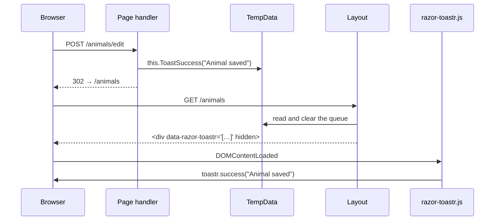

# RazorToastr

**Server-side [toastr](https://github.com/CodeSeven/toastr) flash messages for ASP.NET Core Razor Pages.**

Queue a toast from any page handler, redirect, and it shows up on the next page — with no inline script, so it works under a strict Content-Security-Policy.

[](LICENSE)
[](#requirements)
[](#why-this-exists)

```csharp
public async Task<IActionResult> OnPostAsync()
{
    await _db.SaveChangesAsync();
    this.ToastSuccess("Animal saved");
    return RedirectToPage("Index");
}
```

That's the whole API surface you need for the common case.

---

## Why this exists

The usual way to do this is [NToastNotify](https://github.com/nabinked/NToastNotify), and it served well for years. Two things pushed us to write a replacement:

**It emits an inline `<script>`.** A site running a strict CSP — one without `unsafe-inline` in `script-src` — has its toasts silently dropped. Nothing errors, nothing logs; the message just never appears. RazorToastr writes the queue into a `data-` attribute and lets one packaged asset read it, so the only executable code lives at its own URL, covered by `script-src 'self'`.

**Its dependencies are end-of-life.** NToastNotify 8.0.0 (March 2022, still the latest release) pulls in `Microsoft.AspNetCore.Mvc.ViewFeatures` **2.2.0** and `Microsoft.AspNetCore.StaticFiles` **2.2.0** — ASP.NET Core 2.2 packages, out of support since December 2019, and a recurring source of vulnerability alerts in dependency audits. RazorToastr has **no NuGet dependencies at all**: just a framework reference to `Microsoft.AspNetCore.App`.

It is not a fork. The implementation is written from scratch and shares no code with NToastNotify.

## Installation

### 1. Add the package

```bash
dotnet add package RazorToastr
```

### 2. Register the tag helper

In `Pages/_ViewImports.cshtml` (and `Areas/*/Pages/_ViewImports.cshtml` if you use areas):

```cshtml
@addTagHelper *, RazorToastr
```

### 3. Wire up the layout

toastr is **not** bundled — you keep control of its version, its hosting and your CSP. Load it however you already serve client libraries (LibMan, npm, a CDN), then add this package's asset and the tag helper:

```cshtml
<link href="~/lib/toastr/toastr.min.css" rel="stylesheet" />
<script src="~/lib/toastr/toastr.min.js"></script>
<script src="~/_content/RazorToastr/razor-toastr.js" defer></script>

<toastr-messages />
```

Order matters: `razor-toastr.js` needs `window.toastr` to exist by the time it runs. If toastr is missing it warns once on the console rather than failing silently.

## Usage

Four named helpers on `PageModel`, one per severity:

```csharp
this.ToastSuccess("Animal saved");
this.ToastInfo("Import running in the background");
this.ToastWarning("Two photos were skipped: unsupported format");
this.ToastError("Could not reach the payment provider");
```

An optional second argument adds a heading:

```csharp
this.ToastError("The connection timed out.", "Payment failed");
```

If the severity is itself a variable, pass it explicitly:

```csharp
this.AddToast(succeeded ? ToastLevel.Success : ToastLevel.Error, summary);
```

The same helpers hang off `Controller`, for MVC actions:

```csharp
public IActionResult OnDelete(int id)
{
    _service.Delete(id);
    this.ToastSuccess("Deleted");
    return RedirectToAction(nameof(Index));
}
```

And from a filter, a middleware, or anywhere else without a page or controller at hand, go straight to TempData:

```csharp
tempData.AddToast(ToastLevel.Warning, "Your session is about to expire");
```

Queue as many as you like in one request — they all render, in order.

## How it works



Messages are serialised to JSON in a single TempData entry, so they survive the redirect that a post-redirect-get depends on. The tag helper reads that entry, clears it, and renders it as a hidden data carrier. Clearing on read is what guarantees a toast appears exactly once, even if the user refreshes.

## Requirements

| | |
|---|---|
| **Target frameworks** | net8.0, net10.0 |
| **NuGet dependencies** | none |
| **Framework reference** | `Microsoft.AspNetCore.App` |
| **Client-side** | toastr, supplied by your application |

## Content-Security-Policy

The rendered markup contains no executable code — no inline script, no event handler attribute, no `javascript:` URL. A policy as tight as this is enough:

```
script-src 'self'; style-src 'self'
```

This is asserted by the test suite, not just documented: one test fails the build if the tag helper ever emits a `<script>` element or an attribute beyond `id`, `data-razor-toastr` and `hidden`.

## Escaping

Toast messages routinely echo user-supplied data — a record name, a submitted form field. That data reaches an HTML attribute, so it passes through two independent layers:

1. **JSON serialisation** with the default `JavaScriptEncoder`, which escapes `<`, `>`, `&`, `'` and `"` as `\uXXXX`.
2. **HTML attribute encoding** by the tag helper on top of that.

toastr then renders both message and title as text, never as markup. A payload like `"><script>alert(1)</script>` comes out inert, and a test pins that down.

## Migrating from NToastNotify

The call sites map one to one:

| NToastNotify | RazorToastr |
|---|---|
| `_toastNotification.AddSuccessToastMessage("…")` | `this.ToastSuccess("…")` |
| `_toastNotification.AddInfoToastMessage("…")` | `this.ToastInfo("…")` |
| `_toastNotification.AddWarningToastMessage("…")` | `this.ToastWarning("…")` |
| `_toastNotification.AddErrorToastMessage("…")` | `this.ToastError("…")` |

Then delete what you no longer need:

- the `IToastNotification` field and constructor parameter in every page model — there is no service to inject
- `AddNToastNotifyToastr(…)` from `Program.cs`
- `app.UseNToastNotify()` — there is no middleware
- `@await Component.InvokeAsync("NToastNotify")` from your layouts, replaced by `<toastr-messages />`

Positioning and timeouts were server-side options in NToastNotify. Here they belong to toastr, where they already lived:

```js
toastr.options.positionClass = 'toast-top-right';
toastr.options.timeOut = 5000;
```

## Good to know

**Serving the asset.** `razor-toastr.js` ships as a static web asset, so it needs your app to serve those — `app.UseStaticFiles()` or `app.MapStaticAssets()`, whichever you already call. If the script 404s, that call is what's missing.

**TempData provider.** With the default cookie-based provider, everything queued in one request has to fit in a cookie (about 4 KB). Normal use — a message or two per request — is nowhere near that. Queueing dozens of long messages is not.

**Session state.** None. RazorToastr uses whatever TempData provider your app is already configured with.

## Building from source

```bash
dotnet build
dotnet test
dotnet pack src/RazorToastr -c Release
```

## License

MIT — see [LICENSE](LICENSE).

toastr is a separate MIT-licensed project by its own maintainers; this package depends on it but does not redistribute it.
